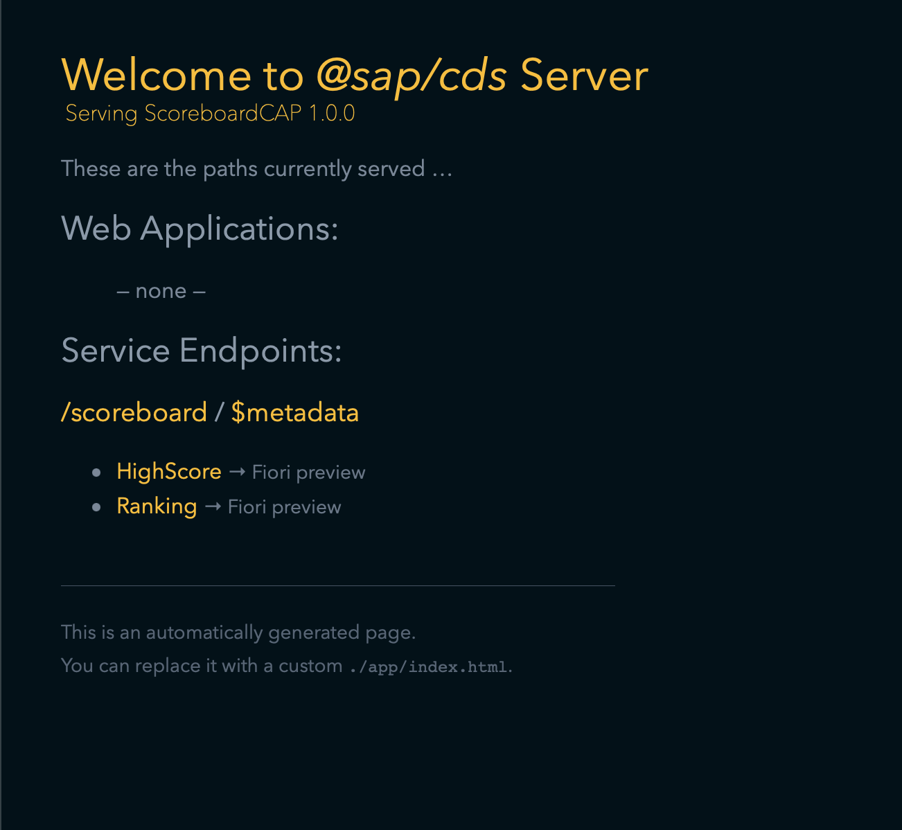

# Simple Scoreboard

This is a simple CAP Application that keeps track of scores.

[CAP get started](https://cap.cloud.sap/docs/get-started/)


## Existing Neo Schema

The old scoreboard was a very simple setup with a quirky token system for protecting updates.

The old services were simple http services that were called from the mobile app, this service is ODATA wihch provides more flexibility.

This version should beextended with an approuter and service broker to enable OAuth2 and SSO. The mobile app can then use OAuth2 when posting scores. This will mean that the token system is no longer needed and also that the app is updated with valid client id and secret.
	   
	@Id
	@GeneratedValue
	private Long id;
	
	@Basic
	@Temporal(TIMESTAMP)
	private Date dateAdded;
	
	@Basic
	private String name;
	
	@Basic
	private Integer score;
	
	@Basic
	private String token;

## Existing Services

### Download
This service is used to download the mobile app and is no longer needed

### High Score

GET: This gets the top 10 Ranking and can run with an ODATA filter ?$orderby=score desc&Ttop=10

POST: Post a new score, the old code used a funky token sytem
this can now be covered with OAuth2 and clientID and Secrets

### Weekly High Score

This is another ODATA query on the High Score table. Simply filter with the date of this week

### Ranking

GET: Get the ranking for the given user with 5 above and below. This one is a little more challenging and is currently not implemented.


## Testing

Install the CAP CLI
````
	npm install -g @sap/cds-dk
````

Run from the project root
````
	cds watch
````

The app will be available at [http://localhost:4004](http://localhost:4004)



The services can be tested in the browse.

### High Score Top 10

Simple ODATA query with orderby and top to limit number of results. Paging is easy too with $skip.

First page of 10:

[http://localhost:4004/scoreboard/HighScore?$orderby=score%20desc&$top=10&$skip=0](http://localhost:4004/scoreboard/HighScore?$orderby=score%20desc&$top=10&$skip=0)


### Weekly High Score Top 10

The created parameter is a date time stamp, so we can filter for the current week. 

[http://localhost:4004/scoreboard/HighScore?$orderby=score%20desc&$filter=created%20gt%202023-02-12T00:00:00.000Z ](http://localhost:4004/scoreboard/HighScore?$orderby=score%20desc&$filter=created%20gt%202023-02-12T00:00:00.000Z)

